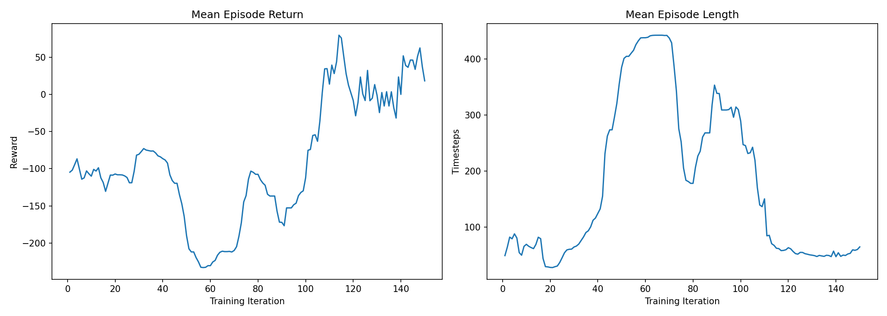
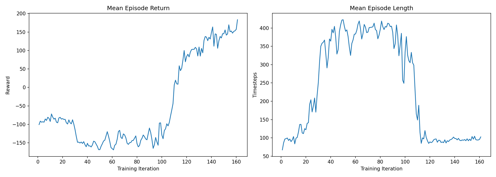

## Random Policy

{width=75%}

---

## Deep Q-Learning Networks (DQN)

{width=75%}

{width=90%}

---

## Proximal Policy Optimization (PPO)

{width=75%}

{width=90%}

---

# Conclusion & Future Work

---

## Limitations

---

## Future Directions

---

